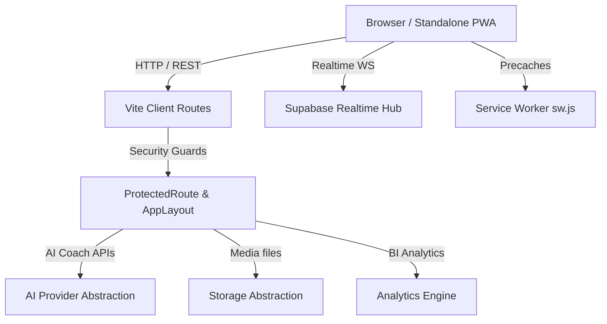

# FitSync - Enterprise Fitness & Health Platform

FitSync is an enterprise-grade, progressive, WCAG 2.2 AA compliant fitness platform built with React, TypeScript, Vite, and Supabase.

---

## 1. High-Level Architecture



---

## 2. Directory Map

* [`/public`](file:///c:/FitSync/public): Static assets including PWA `manifest.json`, `sw.js` workers, and `openapi.json` specifications.
* [`/src/components`](file:///c:/FitSync/src/components):
  * [`/admin`](file:///c:/FitSync/src/components/admin): Audit tables, moderation reports, and observability grids.
  * [`/settings`](file:///c:/FitSync/src/components/settings): Account preference sliders and accessibility toggles.
  * [`/pwa`](file:///c:/FitSync/src/components/pwa): Install Prompts and offline warnings.
  * [`/ui`](file:///c:/FitSync/src/components/ui): Reusable layout controls (Buttons, Cards, Modals).
* [`/src/services`](file:///c:/FitSync/src/services):
  * [`/devops`](file:///c:/FitSync/src/services/devops): Health telemetry and environment selectors.
  * [`/observability`](file:///c:/FitSync/src/services/observability): Level loggers, metrics recorders, and tracing context.
  * [`/recovery`](file:///c:/FitSync/src/services/recovery): Circuit Breakers and retries.
* [`/supabase/migrations`](file:///c:/FitSync/supabase/migrations): SQL DDL schema files from Phase 1 to Phase 16.

---

## 3. Core Feature Matrix

| Feature Module | Responsibilities | DDL File |
| :--- | :--- | :--- |
| **PWA & Sync** | Pre-caching, offline steps queueing, and background syncs | [pwa_system.sql](file:///c:/FitSync/supabase/migrations/20260725116300_fitsync_pwa_system.sql) |
| **Observability** | Structured logging, metrics, and OpenTelemetry correlations | [observability_system.sql](file:///c:/FitSync/supabase/migrations/20260725116400_fitsync_observability_system.sql) |
| **Resilience** | Circuit Breakers, retries, and React layout Error Boundaries | [resilience_system.sql](file:///c:/FitSync/supabase/migrations/20260725116500_fitsync_resilience_system.sql) |
| **AI Coach** | Pluggable Gemini/Claude/OpenAI engines generating diets | [ai_system.sql](file:///c:/FitSync/supabase/migrations/20260725115800_fitsync_ai_system.sql) |

---

## 4. Local Development Setup

### 1. Configure Environment variables
Duplicate `.env.example` to `.env` and fill credentials:
```bash
VITE_SUPABASE_URL="https://your-project.supabase.co"
VITE_SUPABASE_ANON_KEY="your-anon-key"
```

### 2. Install dependencies
```bash
npm install
```

### 3. Run development hot-reload server
```bash
npm run dev
```

### 4. Execute test suites
```bash
npm run test:run
```
